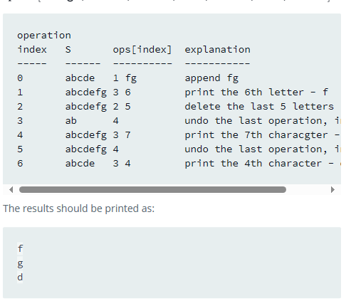

## Simple Text Editor

Implement a simple text editor. The editor initially contains an empty
string, S. Perform @ operations of the following 4 types:

1. append(W) - Append string W to the end of S.

2. delete(k) - Delete the last k characters of S.

3. print(k) - Print the k** character of S.

4. undo() - Undo the last (not previously undone) operation of type 1 or
2, reverting S to the state it was in prior to that operation.

Example

S = ’abcde’

ops = ['1 fg’, ’3 6', ’2 5', '4', '3 7', '4’, ’3 4’]

