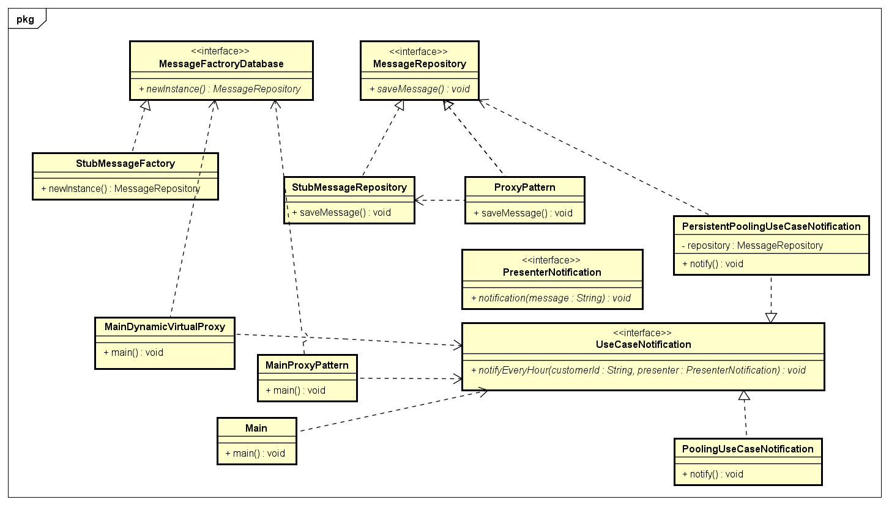

## Desafio de código da Gubee

[1] Como segunda parte do desafio crie uma anotação @Transaction simulando um contexto transacional de uma app com acesso a banco de dados, se um método possuir esta anotação deve imprimir antes da chamada “Iniciando execução do método $metodo.classe” e no final “Finalizando execução do método $metodo.classe com $sucesso | $erro” deve ser executado a partir de um método main.

[2] Explique o que é um userprincipal e para que este é usado dentro de uma app java.

  Geralmente, em aplicações Java, _UserPrincipal_ é uma classe que se refere a um usuário devidamente autenticado na aplicação. 
Assim, podemos usar esse usuário para armazenar informações relacionadas a ele com segurança. Em um ecommerce, por exemplo, 
podemos salvar quais produtos ele compra, suas informações pessoais e assim por diante.   

[3] Faça um diagrama de classes do código a seguir

### Diagrama de classes

